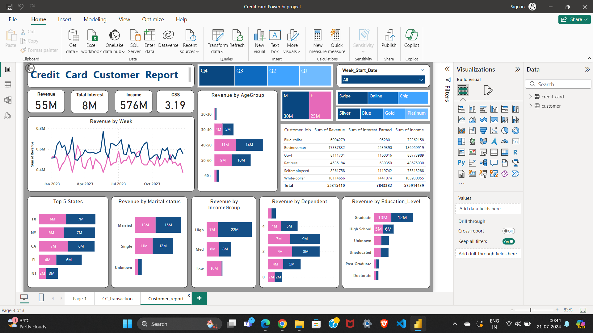

<h2> Credit Card Transaction Report Power BI Dashboard</h2>

<h3>Description:</h3>
The Credit Card Transaction Report Power BI Dashboard provides a comprehensive overview of credit card transactions. It visualizes key metrics such as total transactions, average transaction value, transaction volume trends, and top spending categories. This dashboard helps stakeholders quickly identify spending patterns, detect anomalies, and make informed decisions to optimize transaction processing and customer engagement strategies.

 <h2> Credit Card Customer Report Power BI Dashboard</h2>

<h3>Description:</h3>
The Credit Card Customer Report Power BI Dashboard offers detailed insights into customer demographics and behavior. It features visualizations on customer segmentation, credit utilization rates, spending habits, and delinquency trends. This dashboard enables financial institutions to better understand their customer base, tailor marketing efforts, enhance customer satisfaction, and manage credit risk effectively.

